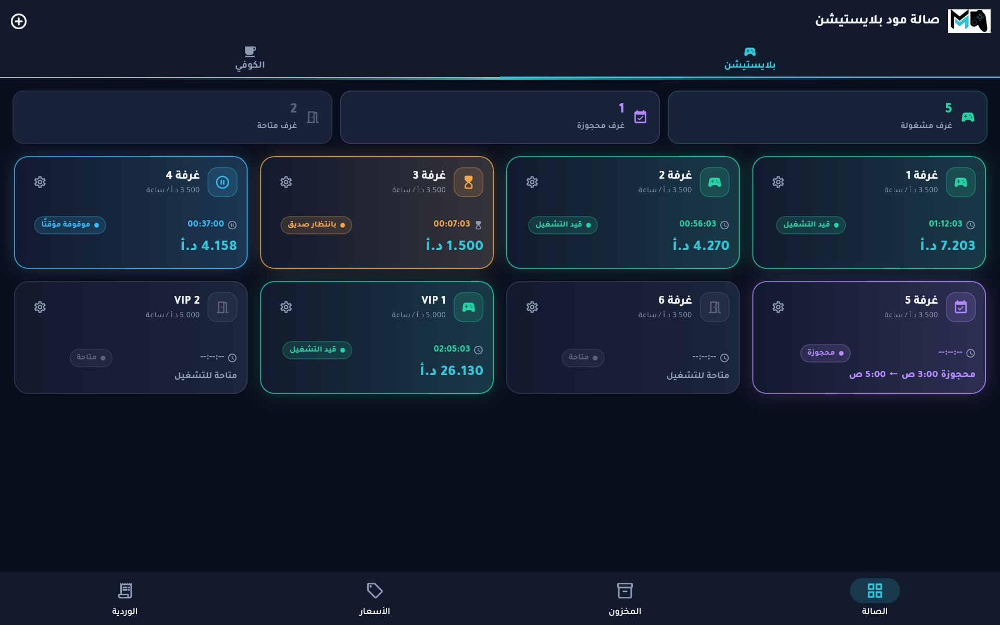

# Mood PlayStation — live demo

**▶ Try it: https://salahianoo.github.io/mood-playstation-demo/**

The point-of-sale and operations app behind a real PS5 lounge and café in Jordan, compiled to the web with sample data so anyone can take a shift behind the counter.

## What it does

- **Live room billing** derived from timestamps, never counters: pause, waiting for a friend, room transfers at frozen rates, extra-controller surcharges
- **Prepaid sessions** with a looping alarm, plus room bookings
- **Café tabs and a POS** wired to inventory, with cost of goods snapshotted per sale
- **Checkout** with discounts, cash / Visa / CliQ and change due
- **The owner's books:** shift close, drawer float, staff withdrawals, expenses, a permanent shift log and a monthly stocktake

**Stack:** Flutter · Dart · Riverpod · Hive · flutter_screenutil. Android, iOS and web from one codebase, fully offline.

This repository only hosts the compiled demo (`app/`) and its landing page. The application source code is private.

## Rebuilding

`./build.sh` copies the app source (default `../MoodPlaystation`, or `MOOD_APP=…`) into `.build/`, applies the demo layer from `overlay/`, compiles it for the web and assembles the site into `docs/`, which GitHub Pages serves.
